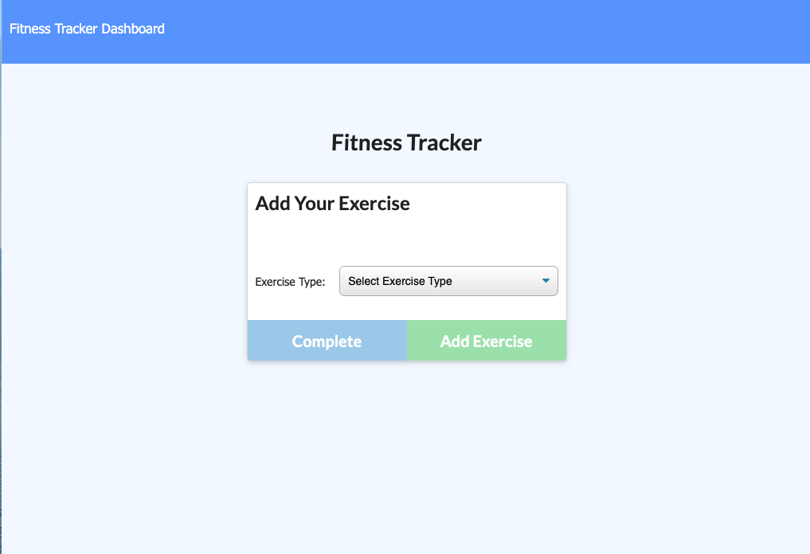

# WorkoutTracker
Nosql Hw 17

## Table of Contents
  - [Description](#Description)
  - [Installation](#Installation)
  - [Usage](#Usage)
  - [License](#License)
  - [Tests](#Tests)

## Description

A fitness tracker application that allows its user to create a new workout routine based on users unique input, add additional exercises to their current routine, and view their weekly stats with graphs. 

## User Story 

* As a user, I want to be able to view create and track daily workouts. I want to be able to log multiple exercises in a workout on a given day. I should also be able to track the name, type, weight, sets, reps, and duration of exercise. If the exercise is a cardio exercise, I should be able to track my distance traveled.

  
## Installation / Technologies Used 

* NodeJS Express
* Mongoose
* MongoDB 

## Usage

  

## License
[MIT](https://opensource.org/licenses/MIT)

